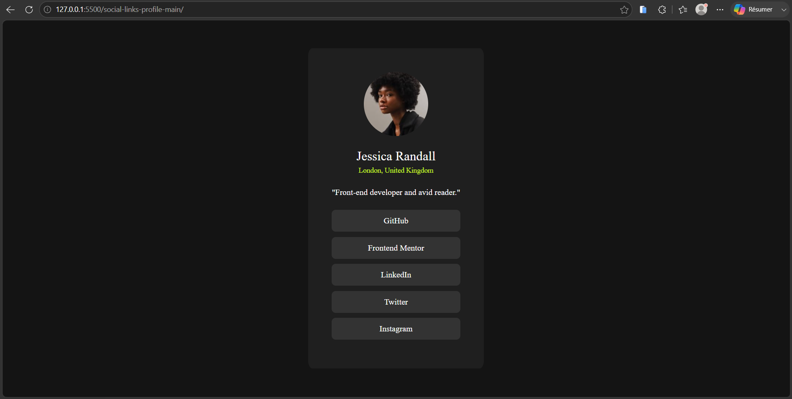
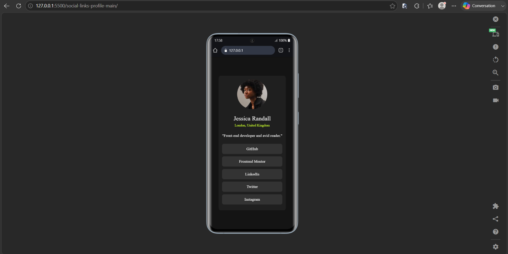

# Frontend Mentor - Social links profile solution

This is a solution to the [Social links profile challenge on Frontend Mentor](https://www.frontendmentor.io/challenges/social-links-profile-UGmZBygYwO). Frontend Mentor challenges help you improve your coding skills by building realistic projects. 

## Table of contents

- [Overview](#overview)
  - [Screenshots](#screenshots)
  - [Links](#links)
- [My process](#my-process)
  - [Built with](#built-with)
  - [What I learned](#what-i-learned)
- [Author](#author)

## Overview

### Screenshots

Here are screenshots of my solution for both desktop and mobile views:

#### Desktop View


#### Mobile View


### Links

- Solution URL: [https://github.com/Abdel-Smash/social-links-profile-frontend-mentor](https://github.com/Abdel-Smash/social-links-profile-frontend-mentor)
- Live Site URL: [https://abdel-smash.github.io/social-links-profile-frontend-mentor/](https://abdel-smash.github.io/social-links-profile-frontend-mentor/)

## My process

### Built with

- Semantic HTML5 markup (using `<main>` and `<section>` structural tags)
- CSS custom properties (Variables for clean theme management)
- CSS Flexbox (applied on the body for perfect vertical and horizontal centering)
- Responsive design via CSS Media Queries

### What I learned

In this project, I focused on writing scalable layouts and improving the user experience (UX) for interactive elements. I mastered using Flexbox directly on the viewport container (`body`) to safely center components without breaking responsiveness. 

Additionally, I reinforced the practice of setting anchor links (`<a>`) inside lists to `display: block`, expanding the clickable hit area across the entire width of the button for better mobile usability.

```css
/* Using Flexbox on the body to position the card perfectly in the center of the screen */
body {
    background-color: var(--Grey900);
    height: 100vh;
    display: flex;
    justify-content: center;
    align-items: center;
}

/* Making the entire button area clickable to optimize user experience */
li a {
    background-color: var(--Grey700);
    display: block;
    padding: 12px 24px;
    text-align: center;
    text-decoration: none;
    border-radius: 8px;
}

```

## Author

- Frontend Mentor - [@Abdel-Smash](https://www.frontendmentor.io/profile/Abdel-Smash)
- GitHub - [@Abdel-Smash](https://github.com/Abdel-Smash)